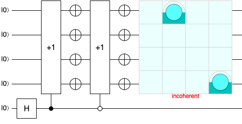
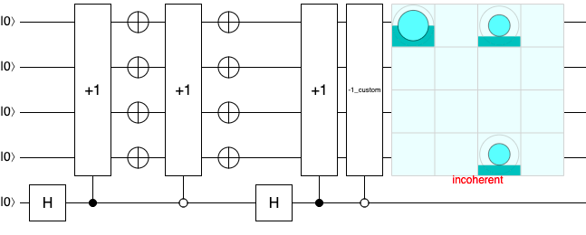
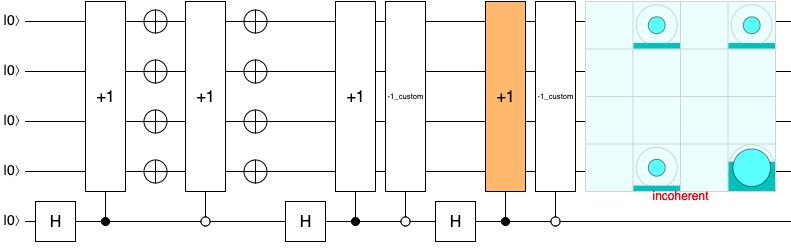
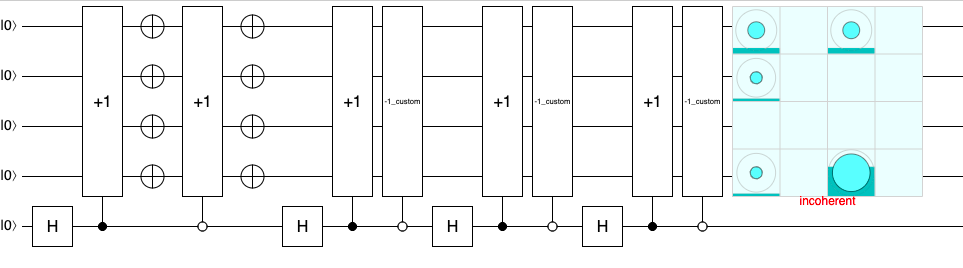
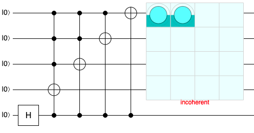
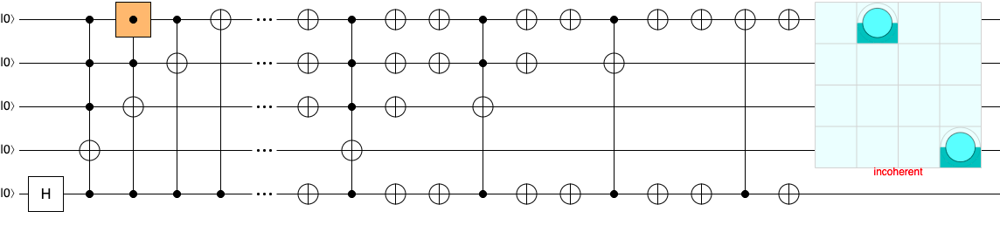
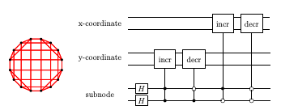

QNibbles
===================
A Quantum implementation of the old QBASIC Game, then made famous by the Nokia 3310 phone
===================

### 1. First approach: Quantum Walk

* Step 1:

* Step 2:

* Step 3:

* Step 4:

In order to create the +1 Gate we can do with multiple controlled NOT gates (I've kept the multiple NOTs for clarity)
* Implementing +1

* Implementing +1 and -1 based on the Hadamard

The whole circuit can be found in the docs:
* [Quantum Walk Notebook](docs/QuantumWalkImplementation.ipynb)

Another alternative that could have been implemented is incrementing the x and y coordinates of the lattice as explained by Dougas and Wang in their paper.

The problem with either of this implementations is that the game can run for hundreds of iterations and our goal is to compare which snake will earn more points.
With over 50 steps, the circuit depth becomes way too big to run in any simulator or real device.

The purpose of Random and Quantum walks is to evaluate the evolution of a system until it finds a stable position (if exists). As such I have decided to take another approach for the problem.

### 2. Second approach: Superposed Snake

In this approach we have taken a more naive (and not very useful) way of running the game, but fun nevertheless.

The Quantum snake will have a 1/8 chance of entering into superposition mode, and split into two possible ways. Each time the snake head "splits" evaluates the neighbour squares and goes on an equal superposition state to each side.
The snake should never hit the wall. BUT it can hit itself. If a splitted head hits its body, it will be "reingested". The snake won't die, but the head won't reproduce anymore.

With the snake heads in superposition, the probability of collision is not 100% anymore, since the head can be or not in that location. So if a snake hits a square, the collision matrix must be >= 1. (collision probabilities add up). But if a head with 25% probability hits a square with 90% collision chance... the snake dies (unless there is a bug in the system. Pun intended)

### 3. Comparing the classical snake with the quantum one.

The classical snake takes a random movement with an added weight towards the apple, so it is not completely dumb.
That is why we see it going towards the apple with higher probability (twice as probable as any other direction).
The random direction calculator removes the possibilities that make it hit the wall, or other snake. So the only possibility of dying is entering a cul de sac.

The Quantum snake also has a higher probability of moving towards the apple, but also has a chance of splitting (SPLIT_LR), this means that one head will become two with 50% chances of occupying one of the three options. Left, Up or Right, depending on whether one of those squares is used.

Once the game ends it starts again. Results are stored in results.csv in the root of the project.

### 4. Next steps
* The code is ugly. Tests and readability improvements are welcome
* Test and play with different strategies for each snake
* You can try to implement the Quantum walk on a 2d lattice as explained above and see if there is any change.

### Running it
* Install Qiskit and Pygame
* Modify the FPS to your taste. Initial value -> FPS = 15
* python qnibbles.py
* Sit back and relax. See how the worms eat each other.

#### References:
* [Nibbles](https://es.wikipedia.org/wiki/NIBBLES.BAS)
* [Quantum walk on Qiskit](https://github.com/Qiskit/qiskit-tutorials/blob/d1689c459fa8a66a9bda6eab41d375db95b15048/quantum_walk.ipynb)
* [Quantum walk efficient implementations (B. L. Douglas, J. B. Wang)](https://arxiv.org/abs/0706.0304)
